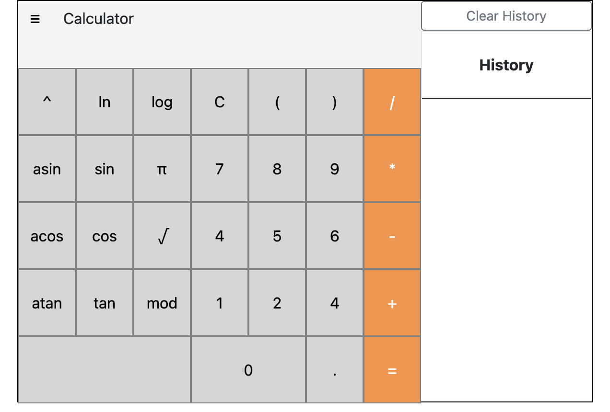
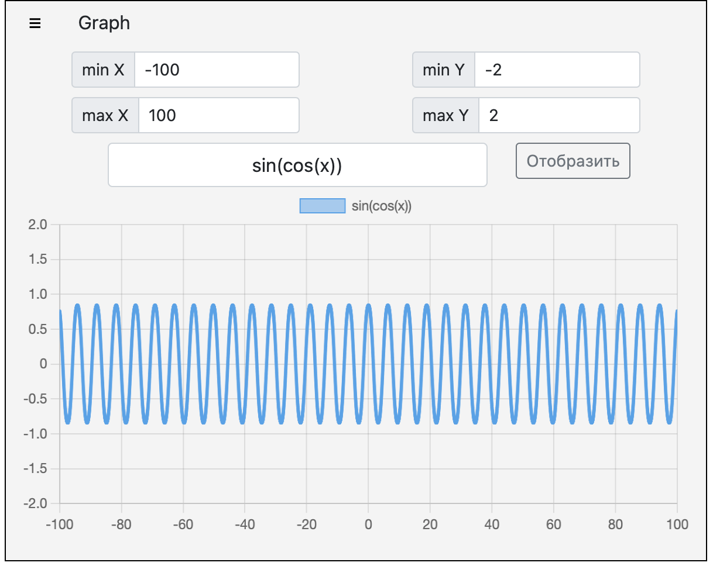

# SmartCalculator_web

## Calculator

Реализация на языке программирования Java расширенной версии обычного калькулятора, поддерживающий
вычисления арифметических выражений с учетом приоритетов, а так же некоторыми математическими функциями.

Производится сохранение истории операций каждого пользователя с возможностью загружать выражения из истории и очищать историю целиком.
История операций сохраняется в базе данных PostgreSQL, история сохраняется после перезагрузки страницы.

## Graph

Построение графика функции, заданной с помощью выражения в инфиксной нотации с переменной x.

Область определения и область значения функций ограничиваются по крайней мере числами от -1000000 до 1000000

График функции строится с помощью библиотеки Chart.js https://github.com/chartjs/Chart.js

